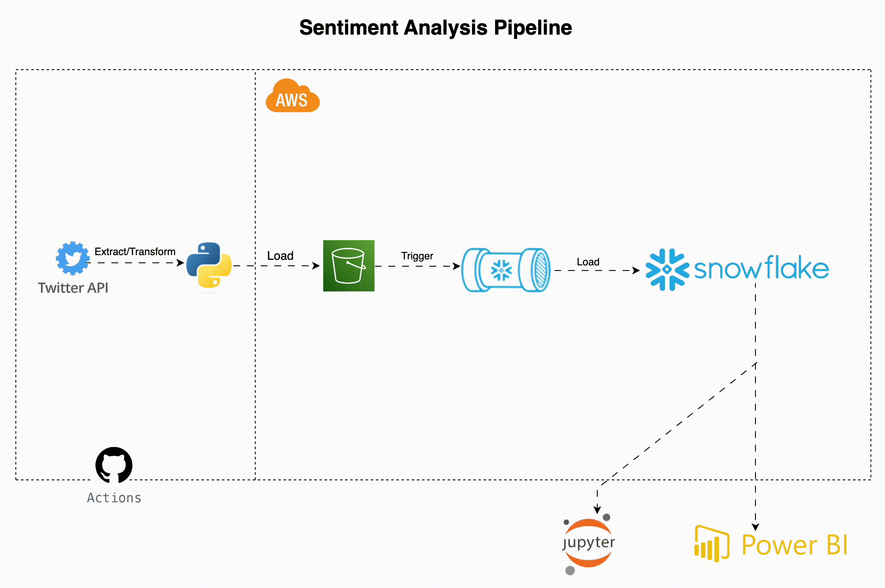

# Sentiment Analysis Pipeline

## Table of Contents
1. [Project Overview](#project-overview)
2. [Selected Brand: PiggyVest](#selected-brand-moniepoint)
3. [Objectives](#objectives)
4. [Contributors](#contributors)
5. [Team Members Task](#team-members-task)
6. [Project Timeline](#project-timeline)
7. [Why Choosing Piggyvest](#why-moniepoint-was-chosen)
   - [Proposed Brand](#proposed-brands)
8. [System Architecture](#system-architecture)
9. [Technology Stack](#technology-stack)

## Project Overview
This project aims to perform sentiment analysis on Twitter data to provide insights into public sentiment towards a specific brand. The pipeline involves extracting data from the Twitter API, transforming the raw data into structured formats, and loading the processed data into an AWS S3 bucket. Snowpipe listens for new files in the S3 bucket and loads them into a Snowflake data warehouse for further analysis. The orchestration of this pipeline is managed using GitHub Actions due to cost considerations and ease of use.

## Selected Brand: Piggvest
### Why Piggvest?
Piggvest is a prominent financial technology company renowned for its innovative savings and investment solutions. The choice of Piggvest was driven by its substantial social media presence and the increasing public interest in its services. By analyzing sentiment around Piggvest, we aim to gain valuable insights into public perception and identify areas for improvement.

## Objectives
- **Sentiment Analysis:** To gauge public sentiment towards Piggyvest based on Twitter data.
- **Data Insights:** To provide actionable insights that can help improve Piggyvest's services.
- **Automation:** To automate the data extraction, transformation, and loading (ETL) process.

## Contributors
- **Data Engineer:** [Ozigbo Chidera](https://github.com/Chideraozigbo)
- **Data Scientist:** [Onuba Winner](https://github.com/ChibuikeOnuba)
- **Data Analyst:** [Daniel Honor](https://github.com/Hon-Nour)

## Team Members Task

### Data Engineer
- **Name:** Ozigbo Chidera
- **Tasks:**
  - Designed and implemented the ETL pipeline to extract, transform, and load data from the Twitter API to AWS S3 and Snowflake.
  - Configured and managed the AWS infrastructure, including S3 buckets, IAM roles, and policies.
  - Developed and maintained the ETL scripts, ensuring efficient and reliable data processing.
  - Implemented logging and monitoring solutions to track the ETL process and troubleshoot issues.
  - Set up GitHub Actions workflows for automated ETL runs and notifications.

### Data Analyst
- **Name:** Honor Daniel
- **Tasks:**
  - Analyzed the extracted tweet data to identify trends and insights related to Piggvest.
  - Created visualizations and dashboards to present the findings to stakeholders.
  - Conducted data validation and cleaning to ensure the accuracy and quality of the data.
  - Worked closely with the data scientist to provide data for model training and evaluation.
  - Prepared detailed reports summarizing the analysis results and recommendations.

### Data Scientist
- **Name:** Onuba Winner
- **Tasks:**
  - Developed sentiment analysis models to assess public sentiment towards Piggyvest.
  - Trained and evaluated machine learning models using the cleaned tweet data.
  - Fine-tuned the models to improve accuracy and performance.
  - Integrated the sentiment analysis models into the ETL pipeline for automated scoring of new tweets.
  - Collaborated with the data analyst to interpret model results and derive actionable insights.

## Project Timeline

Our project is divided into several phases, with tasks distributed among team members based on their roles. Here's a breakdown of our timeline:

### Week 1-2: Project Setup and Infrastructure
- **Chidera Ozigbo (Data Engineer)**: 
  - Set up GitHub repository
  - Design and implement system architecture
  - Configure AWS S3 bucket
  - Set up Snowflake data warehouse
  - Implement Twitter API connection
  - Set up GitHub Actions for automated runs

### Week 3-4: Data Extraction and Processing
- **Chidera Ozigbo (Data Engineer)**: 
  - Develop data extraction script
  - Implement error handling and logging
  - Create data cleaning and transformation pipeline
  - Develop data validation checks
  - Implement Snowpipe for data ingestion
  - Optimize ETL pipeline for performance

### Week 5-6: Data Analysis and Visualization
- **Honor Daniel (Data Analyst)**: 
  - Conduct exploratory data analysis
  - Develop SQL queries for initial insights
  - Design dashboard layout
  - Implement dashboard using chosen visualization tool
  - Create visualization scripts
- **Onuba Winner (Data Scientist)**: 
  - Implement sentiment analysis using TextBlob
  - Develop advanced SQL queries for trend analysis
  - Implement anomaly detection algorithms
  - Conduct in-depth statistical analysis

### Week 7-8: Final Integration, Documentation, and Presentation
- **Chidera Ozigbo (Data Engineer)**: 
  - Integrate all components of the pipeline
  - Conduct end-to-end testing
  - Implement security measures and access controls
  - Prepare deployment documentation
- **Honor Daniel (Data Analyst)**: 
  - Finalize dashboard with real-time data updates
  - Prepare final presentation of insights
  - Create user guide for dashboard
- **Onuba Winner (Data Scientist)**: 
  - Develop predictive models based on sentiment data
  - Conduct performance evaluation of models
  - Prepare technical documentation of analysis and models

## Why Piggyvest Was Chosen

Piggyvest was selected as the brand for this project due to several compelling reasons:

1. **Market Presence:** Piggyvest has a significant presence in the financial technology sector, making it a relevant and impactful brand to analyze.
2. **Customer Interaction:** The brand actively engages with its customers on social media, providing ample data for sentiment analysis and trend identification.
3. **Growth Potential:** As a growing fintech company, understanding public sentiment and customer feedback is crucial for Piggyvest's strategic decisions and growth.
4. **Diverse Data:** Piggyvest's interactions on platforms like Twitter provide diverse and rich data, ideal for developing robust sentiment analysis models.
5. **Innovative Solutions:** Piggyvest is known for its innovative savings and investment solutions, making it an interesting subject for analyzing customer sentiment and feedback.

### Proposed Brands

Here are the lists of brands that was considered before we chose Piggvest.

1. Cowrywise
2. MTN
3. Geepay
4. Uber
5. PiggyVest
6. Hack Sultan
7. Air Peace
8. Moniepoint
9.  Indrive
10. Chowdeck

## System Architecture

Data Flow:
1.	Data Extraction: Tweets are extracted from the Twitter API using a Python script.
2.	Data Storage: The raw tweet data is stored as JSON files in the `data/raw/` directory.
3.	Data Transformation: The raw data is transformed into structured CSV files, which are saved in the `data/processed/` directory.
4.	Data Loading: The raw and processed data files are uploaded to an AWS S3 bucket.
5.	Data Ingestion: Snowpipe listens to the S3 bucket for new files and loads them into a Snowflake data warehouse.
6.	Orchestration: GitHub Actions are used to automate the ETL process, running the script weekly on Tuesdays and sends email anytime a team member pushes a code to the repo.

### Architecture Diagram:

## Technology Stack

